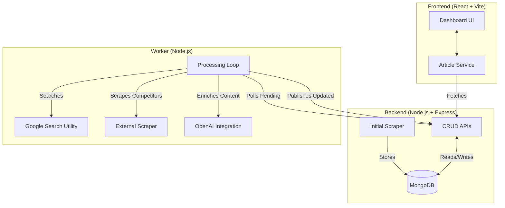

# Article Processing Platform (Monorepo)

A powerful full-stack system that scrapes articles from a source, uses Google Search and LLMs to enrich the content with SEO-optimized formatting and citations, and displays the result in a modern dashboard.

---

## 🏗 Architecture

The project follows a modular service-oriented architecture:



---

## 🔄 Data Flow

1.  **Ingestion**: The **Backend Scraper** fetches the 5 oldest blog posts from `BeyondChats.com` and stores them in **MongoDB** with `isUpdated: false`.
2.  **Discovery**: The **Worker** polls the API for articles where `isUpdated` is `false`.
3.  **Research**: For each article, the Worker searches Google for the title and extracts the top 2 relevant blog/article links.
4.  **Extraction**: The Worker scrapes the main content from those external competitor links, removing noise (ads/nav).
5.  **Enrichment**: The **LLM Utility** sends the original content + competitor content to OpenAI. It rewrites the article for better SEO, formatting, and appends a **References** section with citations.
6.  **Publication**: The Worker sends the enriched content back to the Backend, setting `isUpdated: true`.
7.  **Presentation**: The **React Frontend** fetches all articles and allows users to toggle between the **Original** and **AI-Enhanced** versions.

---

## 🚀 Setup & Installation

### 1. Prerequisites
- **Node.js**: v16+ 
- **MongoDB**: Local or Atlas connection string.
- **OpenAI API Key**: Required for the enrichment phase.

### 2. Environment Configuration

Create a `.env` file in each directory:

#### **backend/.env**
```env
PORT=5000
MONGO_URI=mongodb://localhost:27017/beyondchats
NODE_ENV=development
```

#### **worker/.env**
```env
BACKEND_URL=http://localhost:5000/api
GEMINI_API_KEY=your_gemini_api_key_here
```

### 3. Running the Application

Open three terminals:

**Terminal 1: Backend**
```bash
cd backend
npm install
npm run dev
```

**Terminal 2: Worker**
```bash
cd worker
npm install
node index.js
```

**Terminal 3: Frontend**
```bash
cd frontend
npm install
npm run dev
```

---

## 🛠 Tech Stack

- **Frontend**: React, Vite, Axios, Lucide React (Icons)
- **Backend**: Node.js, Express, MongoDB, Mongoose, Cheerio (Scraping)
- **Worker**: Node.js, OpenAI SDK, Cheerio, Axios
- **Monorepo Management**: Folder-based separation

---

## 📝 API Endpoints

| Method | Endpoint | Description |
| :--- | :--- | :--- |
| `GET` | `/api/articles` | Get all articles (supports `?isUpdated=true/false` filtering) |
| `GET` | `/api/articles/:id` | Get details for a specific article |
| `POST` | `/api/articles/scrape` | Trigger manual scraping of source blog |
| `PUT` | `/api/articles/:id` | Update article content/status |
| `DELETE` | `/api/articles/:id` | Remove an article |
